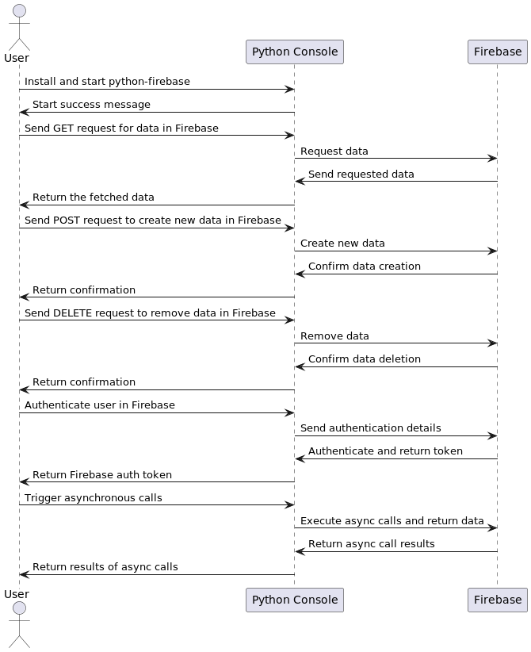

# Python Firebase

Python interface to the Firebase's REST API. Firebase provides a platform that allows you to develop web and mobile applications without server-side programming, making development easier and faster.

[](http://www.firebase.com)

## Table of Contents
- [Installation](#installation)
- [Getting Started](#getting-started)
- [Authentication](#authentication)
- [Concurrency](#concurrency)
- [System Overview with UML](#system-overview-with-uml)
- [Further Topics](#further-topics)
- [Shortcomings](#shortcomings)
- [TODO](#todo)

## Installation

[](https://travis-ci.org/ozgur/python-firebase)

To use `python-firebase`, you must first install the `requests` library. 

```shell
$ sudo pip install requests
$ sudo pip install python-firebase
```

## Getting Started

With Firebase, you can easily fetch your stored data in JSON format. The `python-firebase` interface provides both synchronous and asynchronous methods to interact with your Firebase storage.

You can fetch any of your data in JSON format by appending '.json' to the end of the URL in which your data resides and, then send an HTTPS request through your browser. Like all other REST specific APIs, Firebase offers a client to update(PATCH, PUT), create(POST), or remove(DELETE) his stored data along with just to fetch it.

The library provides all the correspoding methods for those actions in both synchoronous and asynchronous manner. You can just start an asynchronous GET request with your callback function, and the method.

To fetch all the users in your storage simply do the following:
```python
from firebase import firebase
fb_app = firebase.FirebaseApplication('https://your_storage.firebaseio.com', None)
result = fb_app.get('/users', None)
print result
{'1': 'John Doe', '2': 'Jane Doe'}
```
The second argument of **get** method is the name of the snapshot. Thus, if you leave it NULL, you get the data in the URL **/users.json**. Besides, if you set it to **1**, you get the data in the url **/users/1.json**. In other words, you get the user whose ID equals to 1.


```python
from firebase import firebase
fb_app = firebase.FirebaseApplication('https://your_storage.firebaseio.com', None)
result = fb_app.get('/users', '1')
print result
{'1': 'John Doe'}
```

You can also provide extra query parameters that will be appended to the url or extra key-value pairs sent in the HTTP header.

```python
from firebase import firebase
fb_app = firebase.FirebaseApplication('https://your_storage.firebaseio.com', None)
result = fb_app.get('/users/2', None, {'print': 'pretty'}, {'X_FANCY_HEADER': 'VERY FANCY'})
print result
{'2': 'Jane Doe'}
```

Creating new data requires a POST or PUT request. Assuming you don't append **print=silent** to the url, if you use POST the returning value becomes the name of the snapshot, if PUT you get the data you just sent. If print=silent is provided, you get just NULL because the backend never sends an output.

```python
from firebase import firebase
fb_app = firebase.FirebaseApplication('https://your_storage.firebaseio.com', None)
new_user = 'Ozgur Vatansever'

result = fb_app.post('/users', new_user, {'print': 'pretty'}, {'X_FANCY_HEADER': 'VERY FANCY'})
print result
{u'name': u'-Io26123nDHkfybDIGl7'}

result = fb_app.post('/users', new_user, {'print': 'silent'}, {'X_FANCY_HEADER': 'VERY FANCY'})
print result == None
True
```

Deleting data is relatively easy compared to other actions. You just set the url and that's all. Backend sends no output as a result of a delete operation.

```python
from firebase import firebase
fb_app = firebase.FirebaseApplication('https://your_storage.firebaseio.com', None)
fb_app.delete('/users', '1')
# John Doe goes away.
```

## Authentication

Firebase uses token-based authentication. Here's how you can authenticate and retrieve data:

```python
from firebase import firebase
fb_app = firebase.FirebaseApplication('https://your_storage.firebaseio.com', authentication=None)
result = fb_app.get('/users', None, {'print': 'pretty'})
print result
{'error': 'Permission denied.'}

authentication = firebase.FirebaseAuthentication('THIS_IS_MY_SECRET', 'ozgurvt@gmail.com', extra={'id': 123})
fb_app.authentication = authentication
print authentication.extra
{'admin': False, 'debug': False, 'email': 'ozgurvt@gmail.com', 'id': 123, 'provider': 'password'}

user = authentication.get_user()
print user.firebase_auth_token
"eyJhbGciOiAiSFMyNTYiLCAidHlwIjogIkpXVCJ9.eyJhZG1pbiI6IGZhbHNlLCAiZGVidWciOiBmYWxzZSwgIml
hdCI6IDEzNjE5NTAxNzQsICJkIjogeyJkZWJ1ZyI6IGZhbHNlLCAiYWRtaW4iOiBmYWxzZSwgInByb3ZpZGVyIjog
InBhc3N3b3JkIiwgImlkIjogNSwgImVtYWlsIjogIm96Z3VydnRAZ21haWwuY29tIn0sICJ2IjogMH0.lq4IRVfvE
GQklslOlS4uIBLSSJj88YNrloWXvisRgfQ"

result = fb_app.get('/users', None, {'print': 'pretty'})
print result
{'1': 'John Doe', '2': 'Jane Doe'}
```

## Concurrency

The interface heavily depends on the standart **multiprocessing** library when concurrency comes in. While creating an asynchronous call, an on-demand process pool is created and, the async method is executed by one of the idle process inside the pool. The pool remains alive until the main process dies. So every time you trigger an async call, you always use the same pool. When the method returns, the pool process ships the returning value back to the main process within the callback function provided.

```python
import json

from firebase import firebase
from firebase import jsonutil

fb_app = firebase.FirebaseApplication('https://your_storage.firebaseio.com', authentication=None)

def log_user(response):
    with open('/tmp/users/%s.json' % response.keys()[0], 'w') as users_file:
        users_file.write(json.dumps(response, cls=jsonutil.JSONEncoder))

fb_app.get_async('/users', None, {'print': 'pretty'}, callback=log_user)
```

## System Overview with UML

To better understand the interactions between the user, Python console, and Firebase, refer to the following UML diagram:



## Further Topics

As you delve deeper into `python-firebase`, there are advanced topics you might want to explore, such as integrating Firebase with other services, using Firebase with advanced querying, and more.

## Shortcomings

While `python-firebase` provides a robust interface, there might be certain limitations:

1. It primarily supports RESTful operations. For real-time data synchronization, consider using the official Firebase SDKs.
2. Error handling might be generic in some cases. Always handle exceptions appropriately.

## TODO

- [ ] Async calls must deliver exceptions raised back to the main process.
- [ ] More regression/stress tests on asynchronous calls.
- [ ] Docs must be generated.

